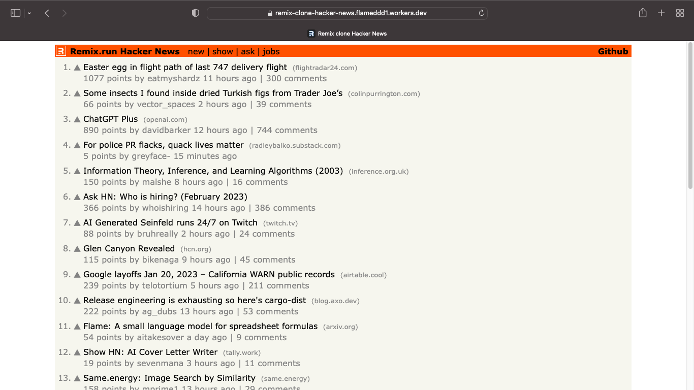
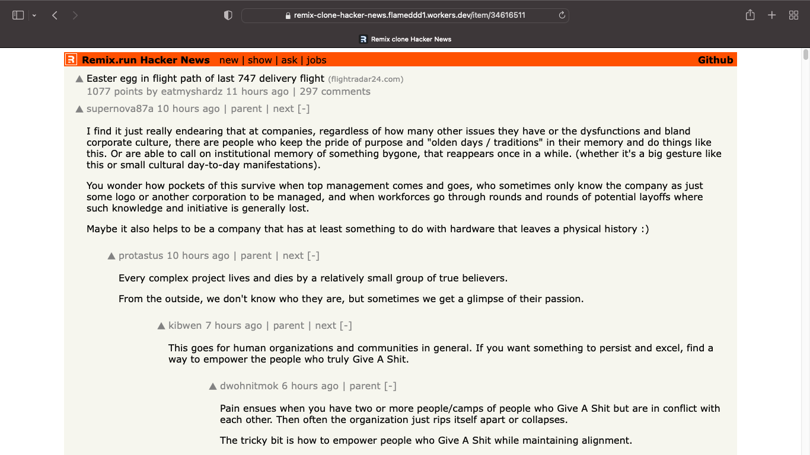
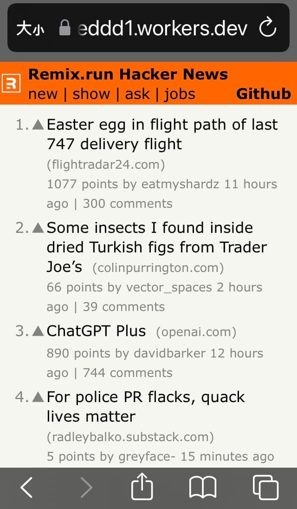
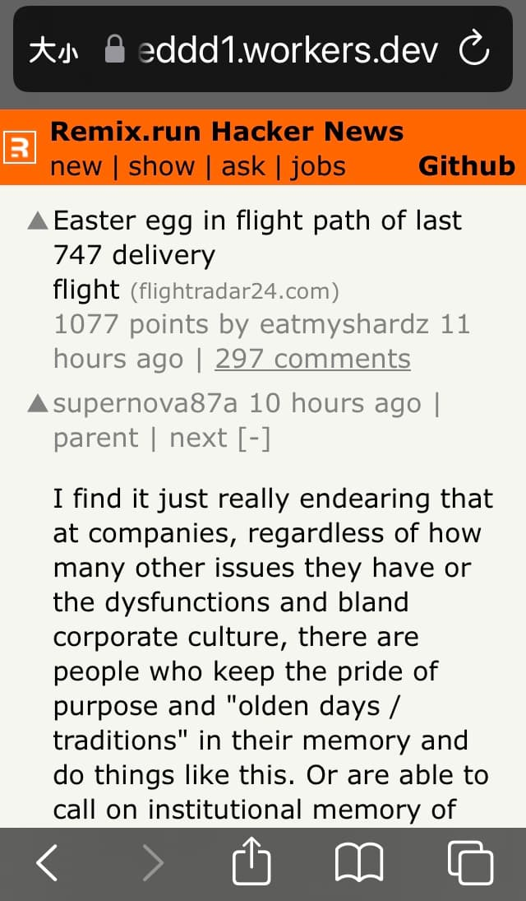

# Remix clone Hacker News

## [Live Demo](https://remix-clone-hacker-news.flameddd1.workers.dev/)

----------------
This Demo app built with following tech
- [GitHub Codespaces](https://docs.github.com/en/codespaces): Cloud development, (via my old 2011 MBA, 1.4G CPU, 4G RAM)
- [Remix.run](https://remix.run/): Server-side web framework
- [Cloudflare Workers](https://workers.cloudflare.com/): Host, serverless
- [Vanilla-extract](https://vanilla-extract.style/): Styling

API:
- [Hacker News API](https://github.com/HackerNews/API)
- [node-hnapi](https://github.com/cheeaun/node-hnapi/)

Refs:
- [Solid Hacker News](https://github.com/solidjs/solid-hackernews)
- [remix-jokes](https://github.com/remix-run/remix-jokes)

  

----------------

## Development:
1. Clone repo
> git clone https://github.com/flameddd/remix-clone-hacker-news.git

2. Install and launch
> npm install  
> npm run dev

Open up [http://127.0.0.1:8787](http://127.0.0.1:8787)

----------------

## More screenshots

  

||||
| :------: | :------: | :------: |
|  |  |  |

----------------

## License
**MIT**
